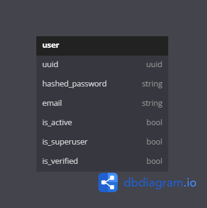

# Бейджи статус пайплайна CI/CD

# Python

# ER диаграмма БД:

# Клонирование репозитория
git clone https://github.com/fv_hr/test_ttk

# Установка и запуск виртуального окружения
make create_venv

# Установка зависимостей
make install_requirements

# Подстановка секретных переменных в окружение .env
DB_USER={имя пользователя mysql}

DB_PASS={пароль пользователя mysql}

DB_HOST={имя хоста mysql}

DB_NAME={имя базы данных mysql}

SECRET_AUTH={секретный ключ для аутентификации}

ALGORITHM={алгоритм шифрования токена}

LIFE_TOKEN={время жизни токена}

LOGIN={логин пользователя api}

PASSWORD={пароль пользователя api}

# Создание таблиц/миграций в базе данных
make make_migrations

# Подстановка секретных переменных в окружение app/websockets/ws_config.conf
[websocket_server]
host_address = host на котором будет запущены websocket server, API, WebAPP

port = port

token = токен доступа к websocket server

run = запуск websocket сервера по умолчанию

# Подстановка секретных переменных в окружение app/modules/modules.conf
состояния{"enable": "Включен", "disable": "Выключен", "reload": "Перезагрузка"}
{название модуля}={состояние}
Пример: my_module2=disable

# Запуск проекта
make run_project

# EndPoints
/pages/chat - ввод токена для аутентификации в websocket

/pages/api - api для работы с websocket server и модулями(доступно только авторизированным пользователям)

/login - вход в api по логину и паролю из [переменных окружения](https://github.com/fvhr/test_ttk/blob/main/README.md#L38-L39
)
